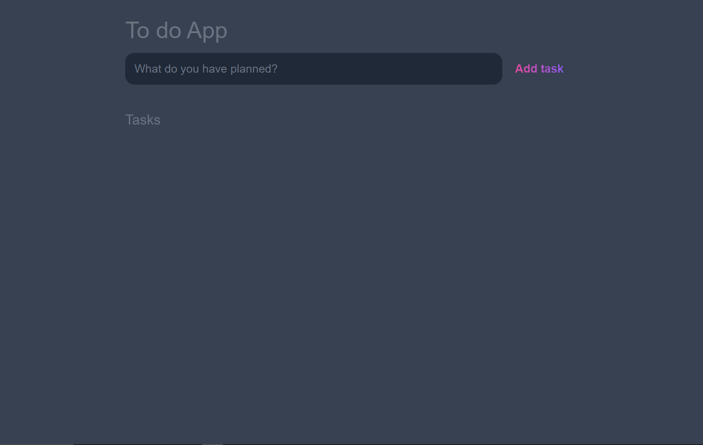
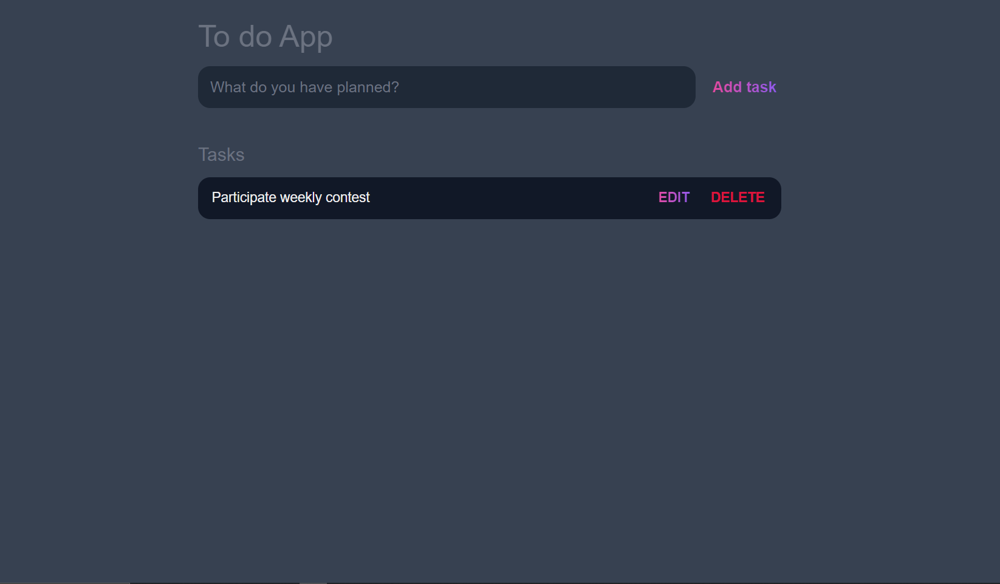
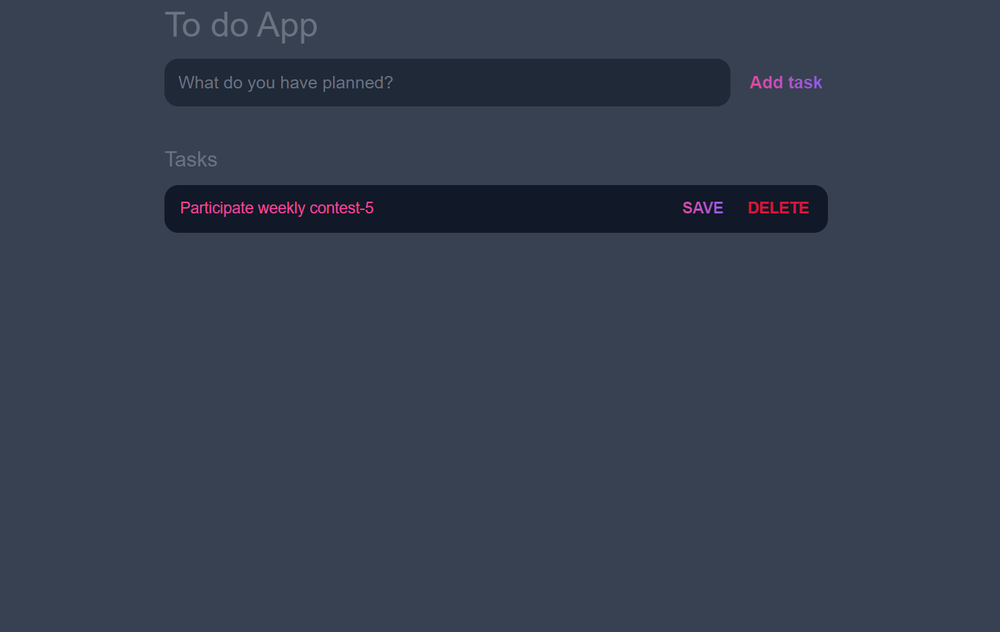

# Todo List

This is a simple todo list app that allows you to add, delete and mark tasks as done.

## Features

- Add a task
- Delete a task
- Edit a task

## Technologies Used

- HTML
- CSS
- JavaScript

## How to run the app

1. Clone the repository
2. Open `index.html` in your browser

## Pages
### Home Page

### Add Task

### Edit Task

