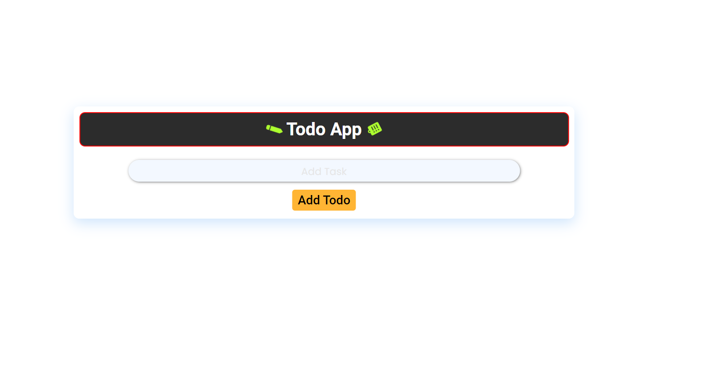
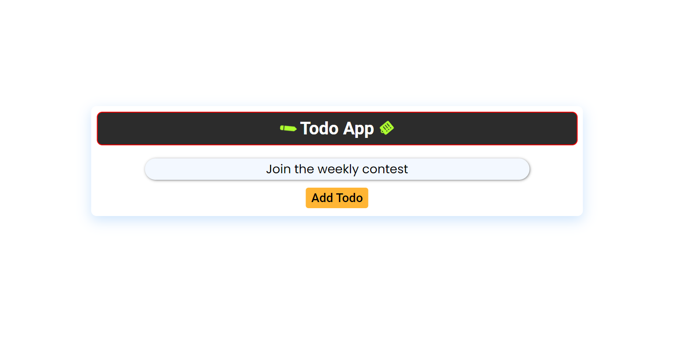
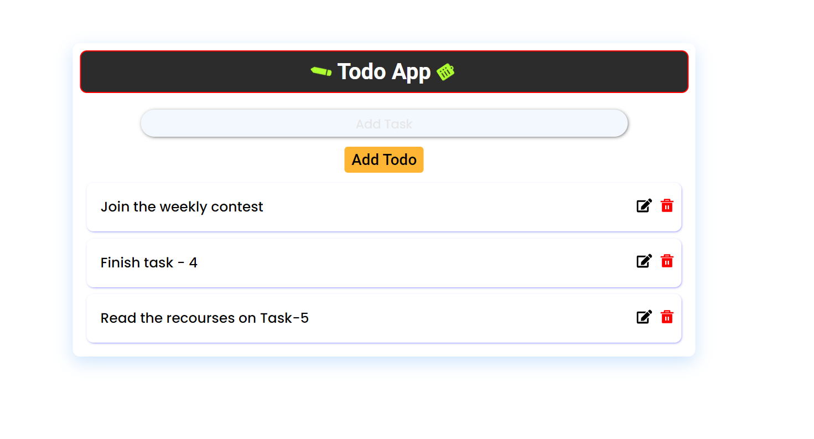
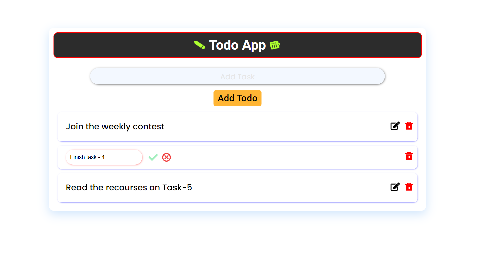

# Todo App
This is a simple todo app that allows you to add, delete and edit tasks. It is built using React and Typescript.

## Features
- Add a task
- Delete a task
- Edit a task

## Technologies
- React
- Typescript
- Cascading Style Sheets(CSS)

## How to run
1. Clone the repository
2. Run `npm install`
3. Run `npm run dev`
4. Open the given URL(eg. `http://localhost:3000`) in your browser

## Screenshots
### Home Page

### Add Task

### Get All Task

### Edit Task

### Delete Task

```
