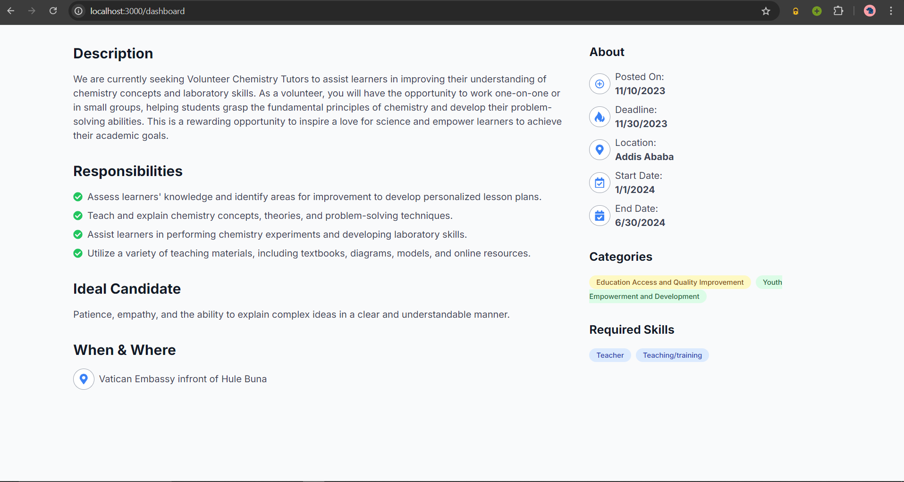
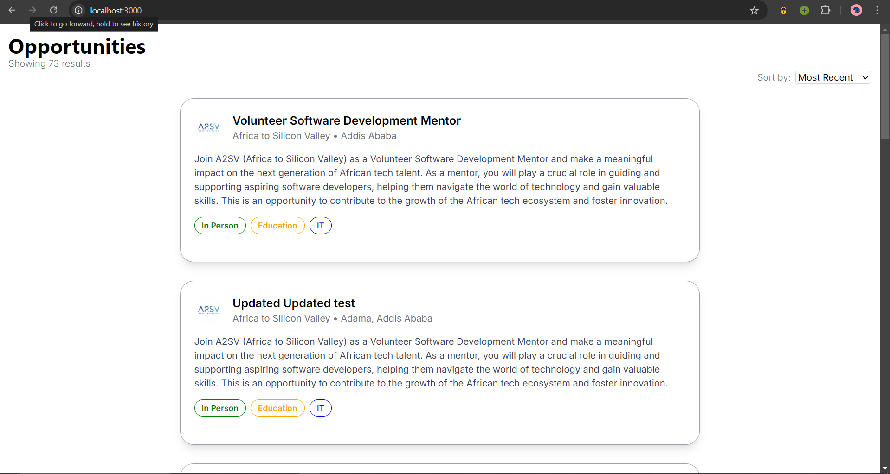
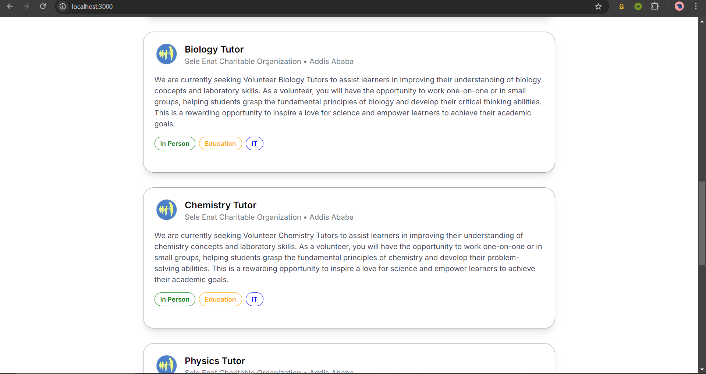
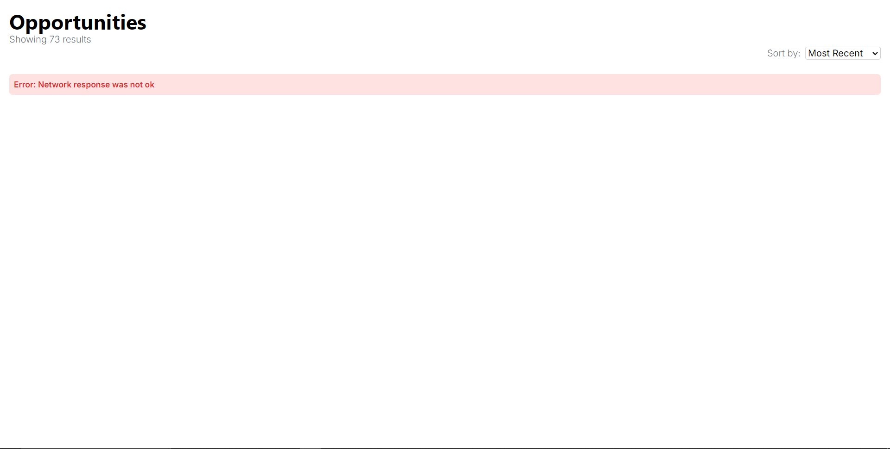
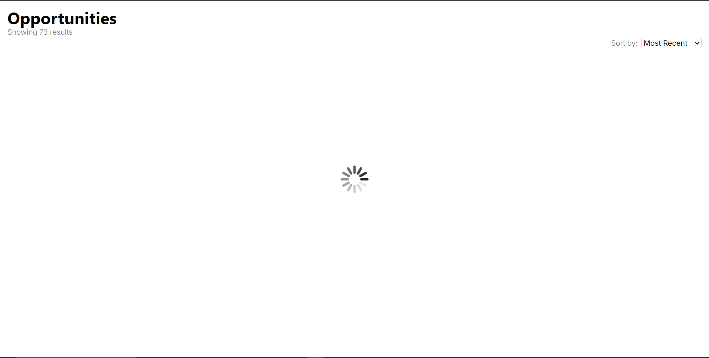

# Task 7
## Integrating API Data into the Application
## Description
Create a React component for a card resembling the one provided in the figma design. Additionally, you need to populate this card with data from the given API. You also need to create the Job Listing Dashboard.

**The Data is populated from the given API.**
## Technologies
- Next.js
- TypeScript
- Tailwind CSS

## How to run
1. Clone this repository
2. Navigate to the task-7 directory
3. Run `npm install`
4. Run `npm run dev`
5. Visit `http://localhost:3000` in your browser
6. To see the Job Listing Dashboard, visit `http://localhost:3000/dashboard`

## Screenshot
### Dashboard


### Job listing




### Error


### Loading

```

