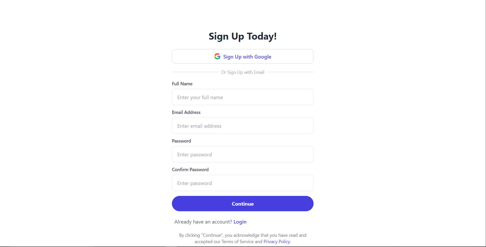
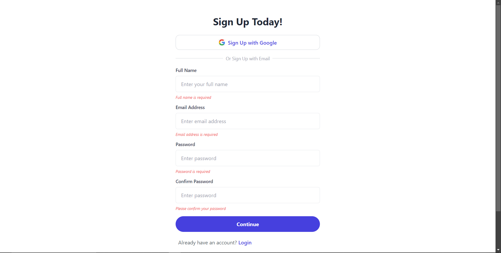
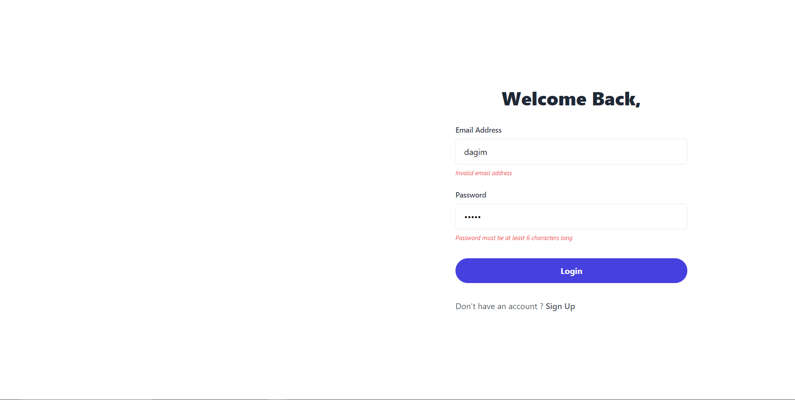
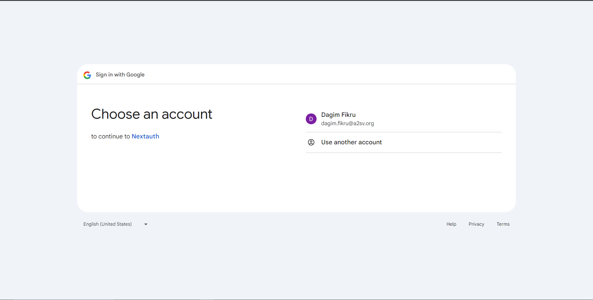
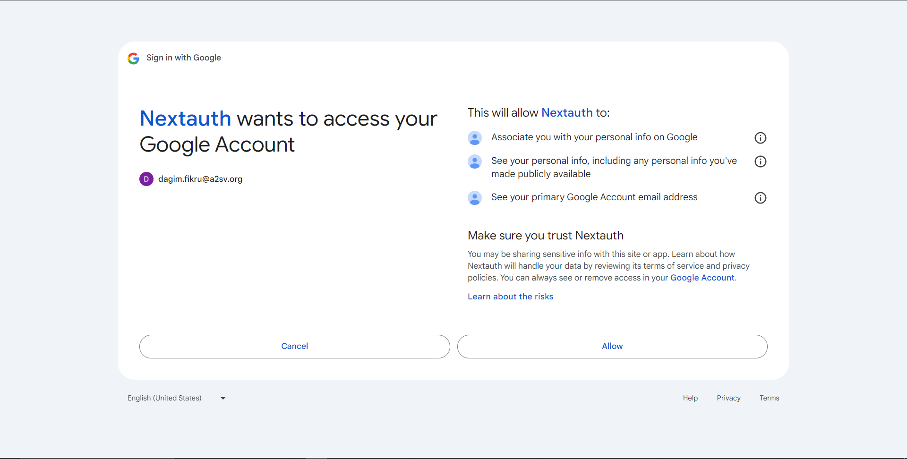
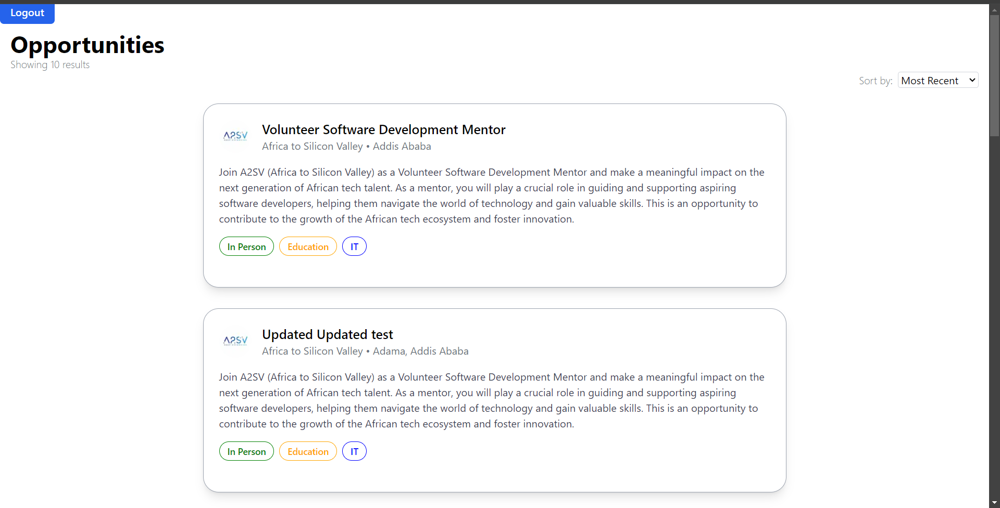
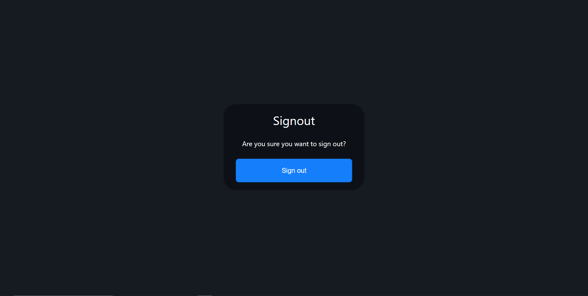

# Task 8
## User Authentication
### Description
Implement authentication functionality using **NextAuth** in your application, including signup and signin pages, and integrate with provided API endpoints for user registration and authentication.

### Technologies
- NextAuth
- Next.js
- TypeScript

### How to run
1. Clone the repository
2. Run `npm install` to install the dependencies
3. Run `npm run dev` to start the development server
4. Open `http://localhost:3000` in your browser

### Screenshots

#### Sign Up

#### Sign up validation

#### Sign In

#### Sign In validation

#### google authentication

#### Logged in

#### Sign Out

