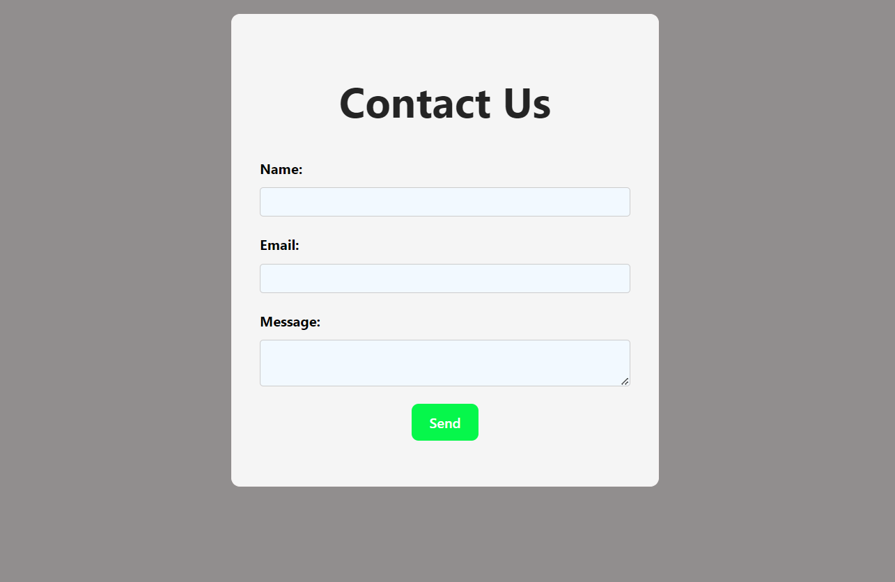
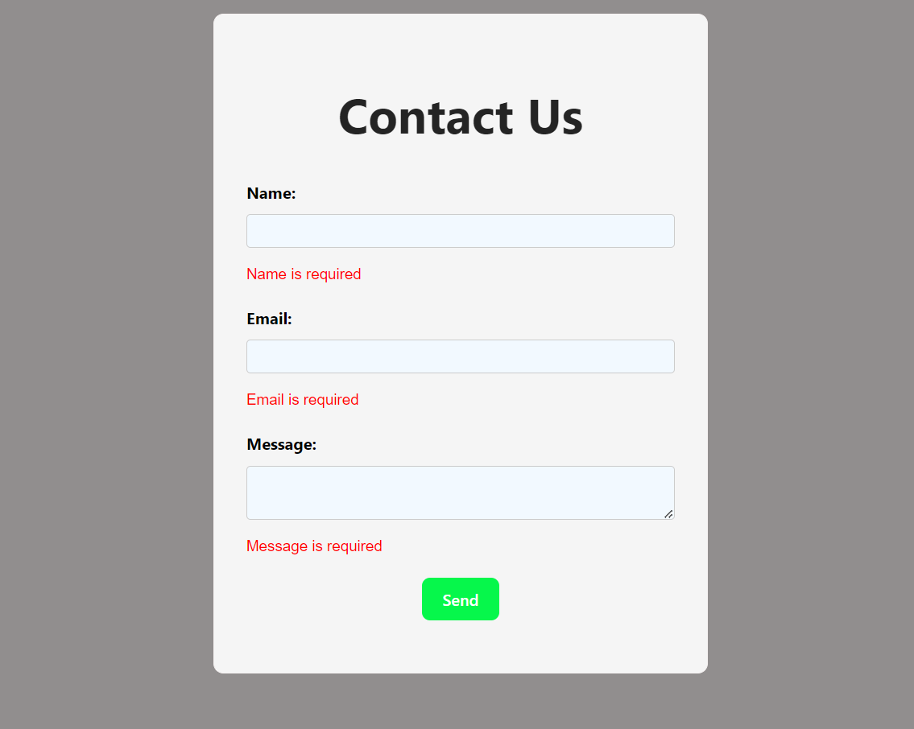
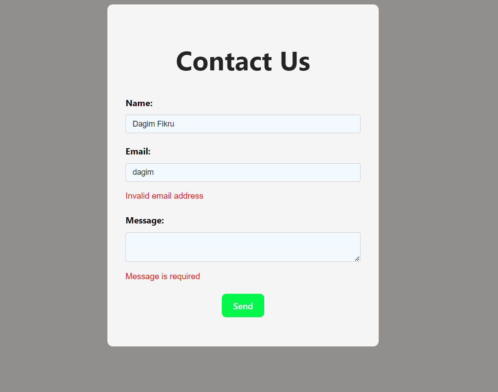
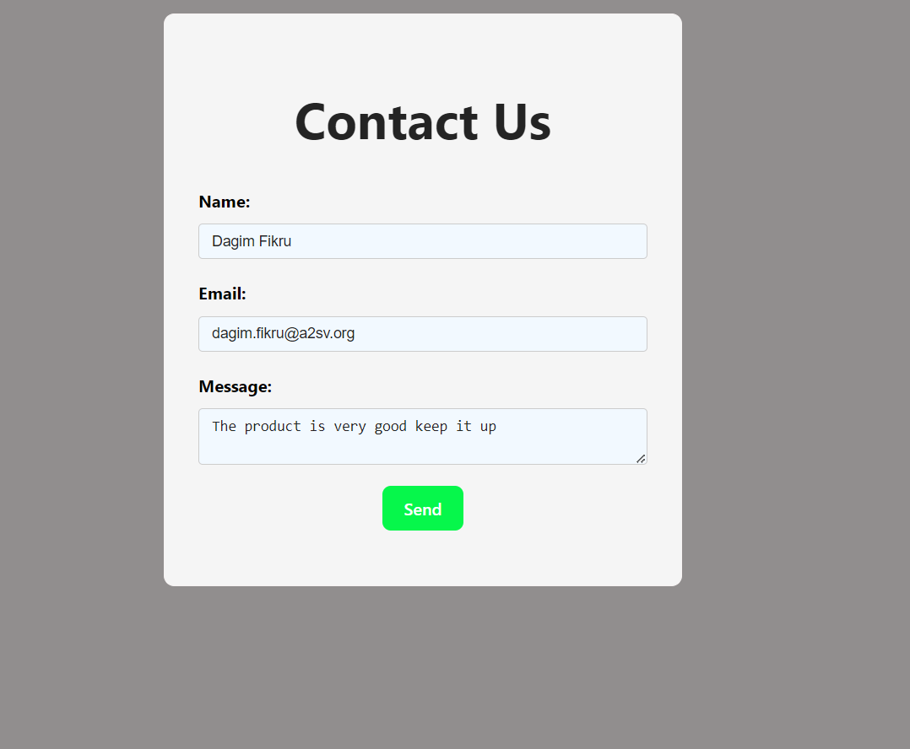
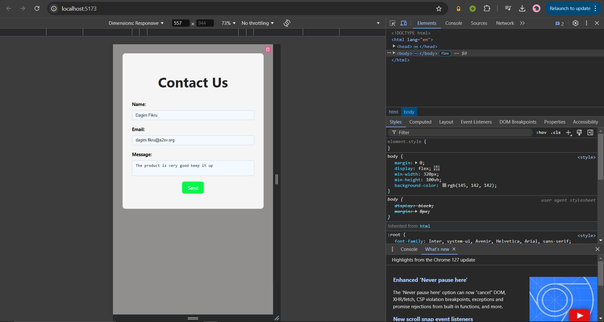

# Task 5
## Description
Create a form using React and Typescript to demonstrate the following:
- Form validation
- Form submission
- Form state management
using React hooks form library.

The form has the following fields:
- Name
- Email
- Message
## Technologies
- React
- Typescript
- React hooks form library
## How to run
1. Clone the repository
2. Navigate to the task-5 directory
3. Run `npm install` to install the dependencies
4. Run `npm run dev` to start the development server
5. Open the browser and navigate to the given URL(eg.`http://localhost:3000/` )

## Screenshots
### Form

### Form validation

### Validation for invalid email

### Error message removed after entering valid data

### Responsive design
