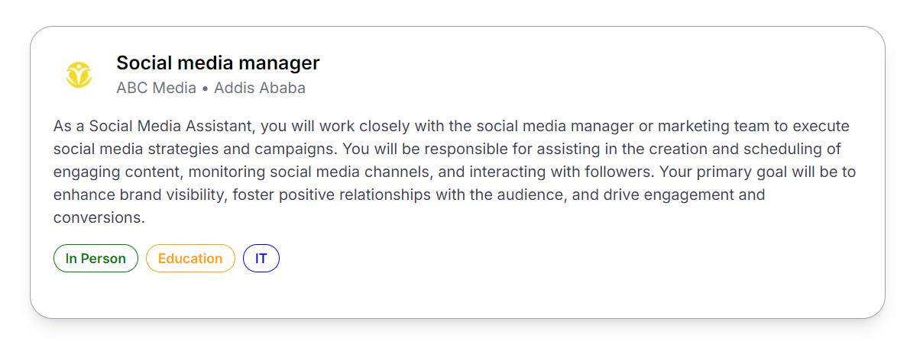
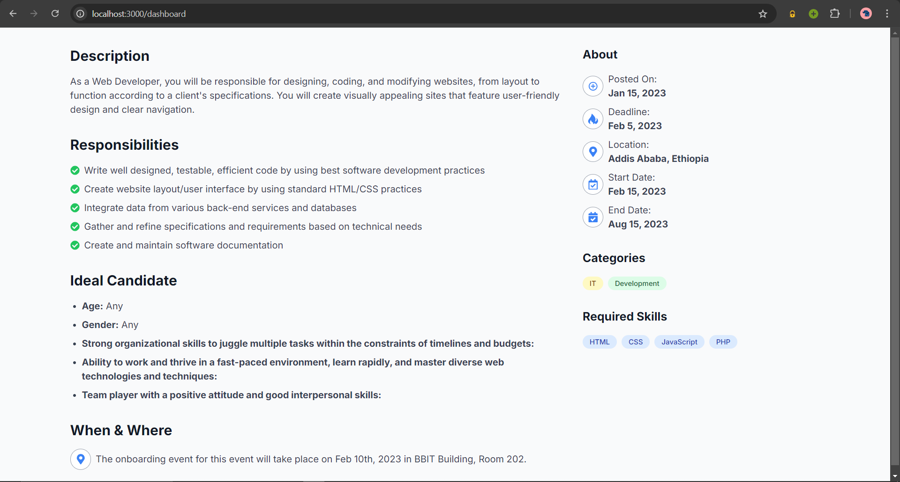
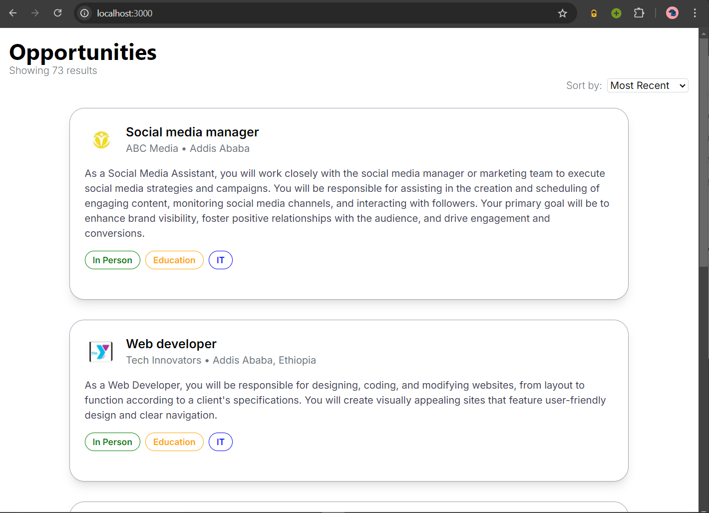
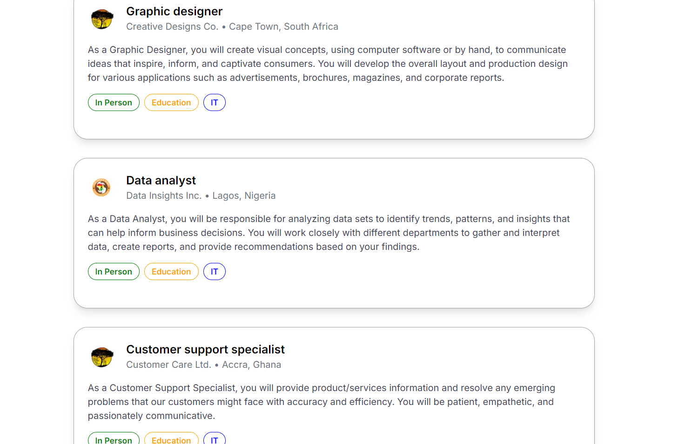

# Task 6
## Description
Create a React component for a card resembling the one provided in the figma design. Additionally, you need to populate this card with dummy data and include an avatar image. You also need to create the Job Listing Dashboard.

**The Data is populated from the `job.json` file.**
## Technologies
- Next.js
- TypeScript
- Tailwind CSS

## How to run
1. Clone this repository
2. Navigate to the task-6 directory
3. Run `npm install`
4. Run `npm run dev`
5. Visit `http://localhost:3000` in your browser
6. To see the Job Listing Dashboard, visit `http://localhost:3000/dashboard`

## Screenshot
### Job card

### Dashboard

### Job listing

